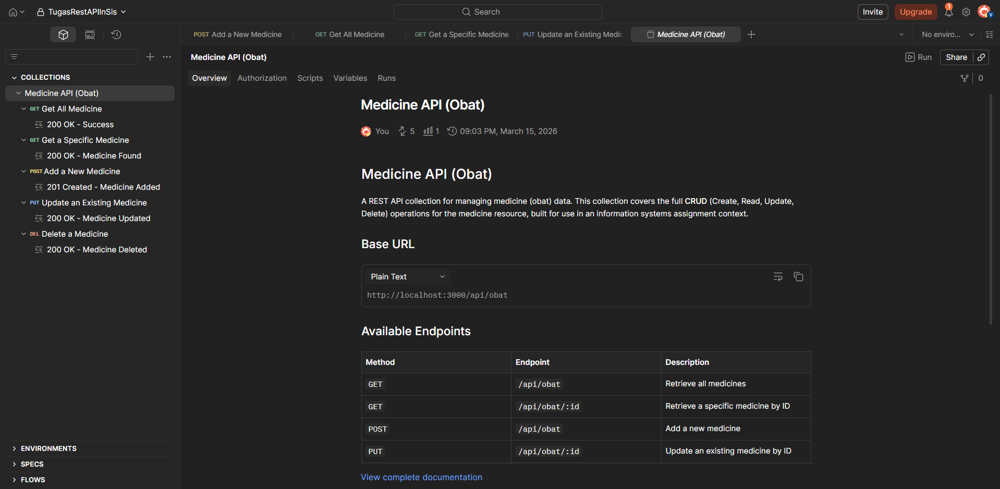
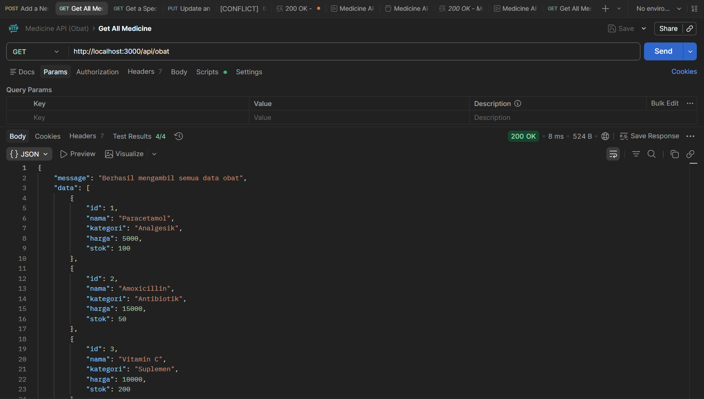
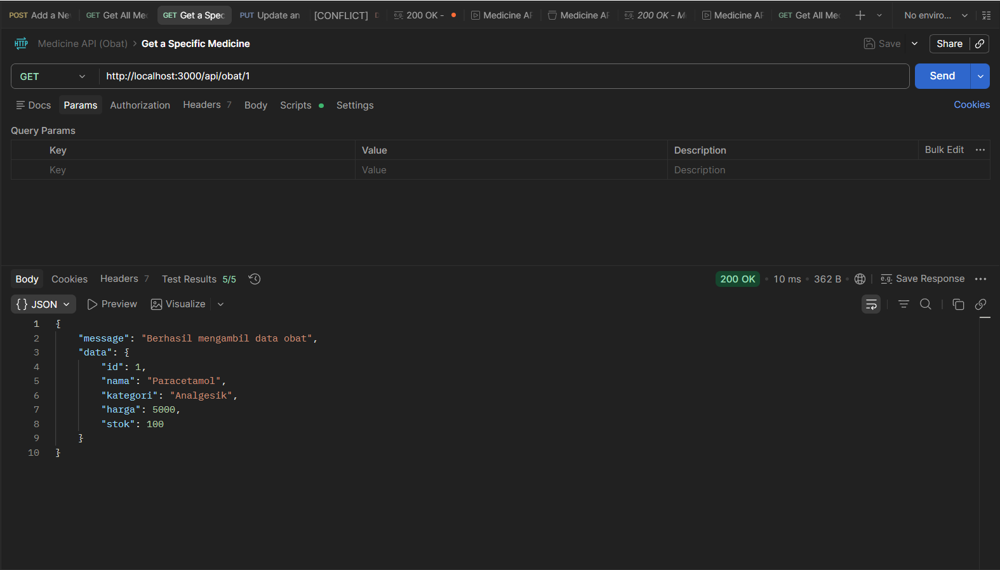
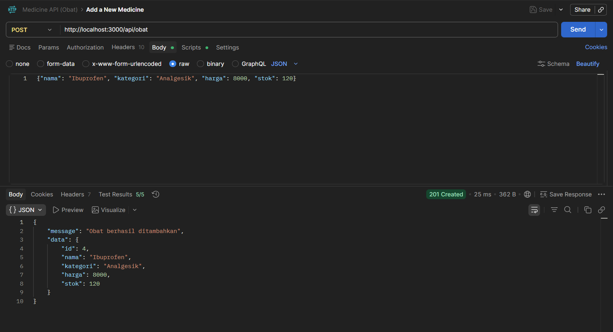
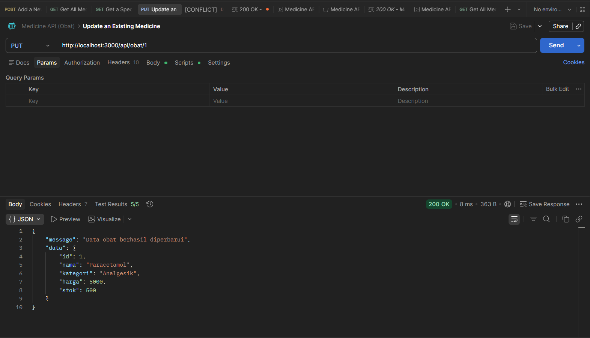
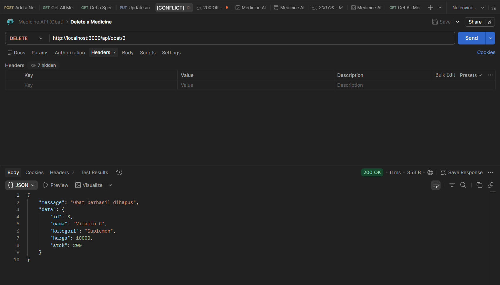

# Apotek REST API



Ini adalah proyek contoh REST API sederhana untuk manajemen data obat di sebuah apotek, dibuat menggunakan Node.js dan Express.js. API ini tidak terhubung ke database nyata (menggunakan array in-memory) sehingga cocok untuk tujuan pembelajaran.

## Fitur (Endpoints)

Base URL: `http://localhost:3000/api/obat`

1.  **Mendapatkan Semua Obat (`GET /api/obat`)**
    *   Deskripsi: Mengambil seluruh daftar obat yang tersedia.
2.  **Mendapatkan Obat Berdasarkan ID (`GET /api/obat/:id`)**
    *   Deskripsi: Mengambil detail spesifik dari satu obat.
3.  **Menambahkan Obat Baru (`POST /api/obat`)**
    *   Deskripsi: Menambah data obat baru ke dalam sistem.
    *   Body (JSON): `nama`, `kategori`, `harga`, `stok`.
4.  **Memperbarui Data Obat (`PUT /api/obat/:id`)**
    *   Deskripsi: Mengubah informasi obat yang sudah ada.
    *   Body (JSON): (Opsional) `nama`, `kategori`, `harga`, `stok`.
5.  **Menghapus Obat (`DELETE /api/obat/:id`)**
    *   Deskripsi: Menghapus data obat dari sistem.

## Struktur Direktori

```text
/
├── images/        # Folder untuk menyimpan aset gambar/dokumentasi
├── .gitignore     # Daftar file dan folder yang diabaikan oleh Git
├── package.json   # Konfigurasi proyek dan dependensi
├── README.md      # Dokumentasi proyek (file ini)
└── server.js      # File utama aplikasi yang berisi logika API
```

## Cara Menjalankan

*Catatan: Repositori ini tidak menyertakan folder `node_modules`. Anda perlu menginstal dependensi terlebih dahulu sebelum menjalankan server.*

### Jika `package.json` sudah tersedia (default)

1. Pastikan Anda telah menginstal [Node.js](https://nodejs.org/).
2. Buka terminal di direktori proyek ini.
3. Instal dependensi proyek (Express sudah terdefinisi di `package.json`):
   ```bash
   npm install
   ```
4. Jalankan server:
   ```bash
   node server.js
   ```
   Atau gunakan:
   ```bash
   npm start
   ```
5. Server akan berjalan di `http://localhost:3000/`. Anda bisa mengujinya menggunakan Postman, Insomnia, atau Thunder Client.

### Jika `package.json` tidak tersedia (dari scratch)

1. Pastikan Anda telah menginstal [Node.js](https://nodejs.org/).
2. Buka terminal di direktori proyek ini.
3. Inisialisasi proyek Node.js baru:
   ```bash
   npm init -y
   ```
4. Instal framework Express:
   ```bash
   npm install express
   ```
5. Jalankan server:
   ```bash
   node server.js
   ```
6. Server akan berjalan di `http://localhost:3000/`. Anda bisa mengujinya menggunakan Postman, Insomnia, atau Thunder Client.

---

## Dokumentasi (`Medicine API (Obat)`)

API ini memungkinkan Anda untuk mengelola koleksi obat dengan berbagai endpoint untuk membuat, membaca, memperbarui, dan menghapus data obat. Setiap obat memiliki detail seperti ID, nama (`nama`), kategori (`kategori`), harga (`harga`), dan stok (`stok`). Semua respons dikembalikan dalam format JSON.

---

## Base URL

```
http://localhost:3000/api/obat
```

---

## Endpoints

### 1. Mendapatkan Semua Obat (Get All Medicine)



- **Endpoint:** `GET /api/obat`
- **Deskripsi:**
  Mengambil daftar semua obat yang saat ini tersimpan di dalam sistem. Mengembalikan array berupa objek obat, di mana masing-masing objek berisi ID obat, nama (`nama`), kategori (`kategori`), harga (`harga`), dan jumlah stok (`stok`). Tidak memerlukan request body atau parameter tambahan.

#### Contoh Respons (200 OK)
```json
[
  { "id": 1, "nama": "Paracetamol", "kategori": "Analgesik", "harga": 5000, "stok": 100 },
  { "id": 2, "nama": "Amoxicillin", "kategori": "Antibiotik", "harga": 15000, "stok": 50 },
  { "id": 3, "nama": "Vitamin C", "kategori": "Suplemen", "harga": 10000, "stok": 200 }
]
```

---

### 2. Mendapatkan Obat Spesifik (Get a Specific Medicine)



- **Endpoint:** `GET /api/obat/:id`
- **Deskripsi:**
  Mengambil detail dari satu obat berdasarkan ID uniknya. Ganti `:id` di URL (contoh: `/1`, `/2`) dengan ID obat yang dituju. Akan mengembalikan error 404 jika obat tidak ditemukan.

#### Contoh Respons (200 OK)
```json
{ "id": 1, "nama": "Paracetamol", "kategori": "Analgesik", "harga": 5000, "stok": 100 }
```

---

### 3. Menambahkan Obat Baru (Add a New Medicine)



- **Endpoint:** `POST /api/obat`
- **Header:** `Content-Type: application/json`
- **Body:**
```json
{
  "nama": "Ibuprofen",
  "kategori": "Analgesik",
  "harga": 8000,
  "stok": 120
}
```
- **Deskripsi:**
  Menambahkan obat baru ke dalam sistem. Jika berhasil, akan mengembalikan objek obat yang baru dibuat secara utuh beserta ID yang di-generate secara otomatis.

#### Contoh Respons (201 Created)
```json
{ "id": 4, "nama": "Ibuprofen", "kategori": "Analgesik", "harga": 8000, "stok": 120 }
```

---

### 4. Memperbarui Data Obat (Update an Existing Medicine)



- **Endpoint:** `PUT /api/obat/:id`
- **Header:** `Content-Type: application/json`
- **Body:** Sertakan kombinasi field apa saja yang ingin diperbarui (`nama`, `kategori`, `harga`, `stok`):
```json
{ "stok": 500 }
```
- **Deskripsi:**
  Memperbarui satu atau beberapa data dari obat yang sudah ada berdasarkan ID-nya. Hanya field yang diberikan pada body yang akan diperbarui. Mengembalikan objek obat yang telah diperbarui secara penuh, atau error 404 jika ID obat tidak ditemukan.

#### Contoh Respons (200 OK)
```json
{ "id": 1, "nama": "Paracetamol", "kategori": "Analgesik", "harga": 5000, "stok": 500 }
```

---

### 5. Menghapus Obat (Delete a Medicine)



- **Endpoint:** `DELETE /api/obat/:id`
- **Deskripsi:**
  Menghapus obat berdasarkan ID uniknya. Mengembalikan pesan konfirmasi jika berhasil, atau error 404 jika ID tidak ditemukan. **Catatan:** Karena data disimpan di dalam memori (in-memory), merestart server akan mengembalikan semua data ke kondisi awal.

#### Contoh Respons (200 OK)
```json
{ "message": "Medicine with ID 3 has been deleted successfully." }
```

---

## Catatan (Notes)

- Semua field bersifat wajib (required) kecuali dinyatakan lain.
- Waktu respons diharapkan berada di bawah 500ms untuk semua operasi.
- Respons error (misalnya 404) akan mengembalikan pesan deskriptif.
- Dokumentasi Postman : https://documenter.getpostman.com/view/49384603/2sBXigMZEJ

---